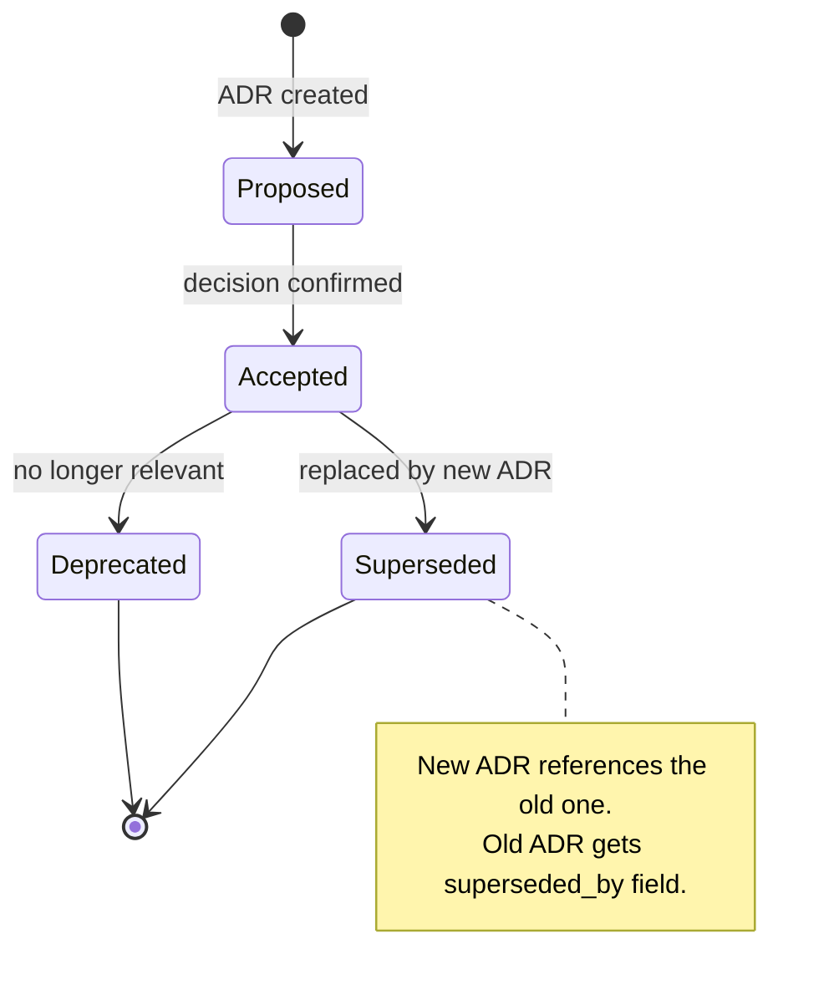

## Prerequisites

This skill is invoked by the `proven-needs` orchestrator or by the `needs-design` capability when technology decisions are identified during the design process.

## Artifact Format

Each ADR is a YAML file at `docs/adrs/NNNN-<kebab-case-title>.yaml`, validated by a JSON schema. An index file at `docs/adrs/index.yaml` provides a summary view of all decisions.

**ADR Schema:** `skills/needs-adr/schemas/adr.schema.json`

**Index Schema:** `skills/needs-adr/schemas/adr-index.schema.json`

**Validation:** `python skills/needs-adr/scripts/validate-adrs.py docs/adrs/`

## Observe

Assess the current state of architecture decisions.

### 1. Read existing ADRs

Look for `docs/adrs/` and `docs/adrs/index.yaml`.

**If the directory exists:** Read `index.yaml` to understand existing decisions. Extract:
- All ADR IDs, titles, statuses, and dates
- The next available sequence number

**If no directory exists:** Note that no ADRs exist. Next number is `0001`.

### 2. Read constraints

Read `docs/constraints.yaml`. Identify constraints that may be relevant to the decision (architecture constraints, licensing constraints for technology choices).

### 3. Report observation

Return to the orchestrator:
```
ADRs: {exists: true/false, count: N, accepted: N, deprecated: N, superseded: N, next-number: "NNNN"}
```

## Evaluate

Given the desired state (a technology decision that needs recording), determine what action is needed.

### 1. Is this decision already recorded?

- Search existing ADRs for decisions covering the same topic
- If an accepted ADR already covers this decision -> no action needed (report to orchestrator)
- If an accepted ADR exists but the decision has changed -> supersession needed
- If no ADR covers this topic -> new ADR needed

### 2. Check constraints

- Would the proposed technology decision violate any constraint? (e.g., licensing constraint for a dependency choice)
- Flag constraint conflicts to the orchestrator

### 3. Report evaluation

Return to the orchestrator:
```
Action: create / supersede / none
Existing related ADR: ADR-NNNN (if applicable)
Constraint conflicts: [list or none]
```

## Execute

### Creating a new ADR

#### 1. Gather decision context

For each decision, identify:
- **Context** -- what is the issue motivating this decision?
- **Decision** -- what is the chosen approach?
- **Consequences** -- what becomes easier or harder?
- **Alternatives considered** -- what other options were evaluated and why rejected?

**When invoked by the orchestrator standalone:** Ask the user for this information.
**When invoked from `needs-design`:** The design capability provides the context and asks the user to confirm.

#### 2. Write the ADR file

Create `docs/adrs/NNNN-<kebab-case-title>.yaml`:

```yaml
# yaml-language-server: $schema=../../skills/needs-adr/schemas/adr.schema.json

schema_version: "1.0.0"
id: ADR-NNNN
title: <Decision Title>
status: Accepted
date: "YYYY-MM-DD"
deciders: <who was involved>

context: >-
  <What is the issue motivating this decision?>

decision: >-
  <What is the change being made?>

consequences:
  easier:
    - <What becomes easier>
  harder:
    - <What becomes harder>

alternatives:
  - name: <Alternative 1>
    reason_rejected: >-
      <Why this was not chosen>
```

**Status values:**



- `Proposed` -- decision not yet confirmed
- `Accepted` -- decision is in effect
- `Deprecated` -- decision is no longer relevant
- `Superseded` -- replaced by a newer decision (must include `superseded_by` field)

**Numbering:** Always use 4-digit zero-padded sequence numbers (`0001`, `0002`, ...).

**File naming:** `NNNN-kebab-case-title.yaml` (e.g., `0001-use-typescript.yaml`).

#### 3. Update the index

Create or update `docs/adrs/index.yaml`:

```yaml
# yaml-language-server: $schema=../../skills/needs-adr/schemas/adr-index.schema.json

schema_version: "1.0.0"
version: "1.0.0"
last_updated: "YYYY-MM-DD"

decisions:
  - id: ADR-0001
    title: Use TypeScript for Backend and Frontend
    status: Accepted
    date: "2026-02-18"
    file: 0001-use-typescript.yaml
```

**Index version rules:**
- `:version:` uses SemVer, starts at `1.0.0`
- MINOR bump when ADRs are added
- PATCH bump for metadata-only changes (status updates, date corrections)
- MAJOR bumps do not apply since ADRs are never removed
- Always update `last_updated` to today's date

#### 4. Validate

Run the validation script to verify all ADR files and the index:

```
python skills/needs-adr/scripts/validate-adrs.py docs/adrs/
```

Fix any errors before reporting completion.

### Superseding an existing ADR

When a decision changes:
1. Set the old ADR's `status` to `Superseded` and add `superseded_by: ADR-NNNN`
2. Create a new ADR referencing the old one in its `context` and `references` fields
3. Update the index (both old and new entries)
4. Run validation

### Deprecating an ADR

When a decision becomes irrelevant:
1. Set the ADR's `status` to `Deprecated`
2. Update the index
3. Run validation

Never delete ADR files. ADRs are append-only records.

## Quality Checklist

Before finalizing, verify:
- ADR ID matches the filename number (0001-*.yaml contains ADR-0001)
- Status is valid and consistent (Superseded ADRs have `superseded_by`)
- Consequences list both easier and harder impacts
- Alternatives are documented with clear rejection reasons
- Index is up to date and consistent with individual files
- The validation script passes: `python skills/needs-adr/scripts/validate-adrs.py docs/adrs/`

## Reference

See `references/0001-use-typescript.yaml`, `references/0002-use-postgresql.yaml`, and `references/index.yaml` for complete examples.
