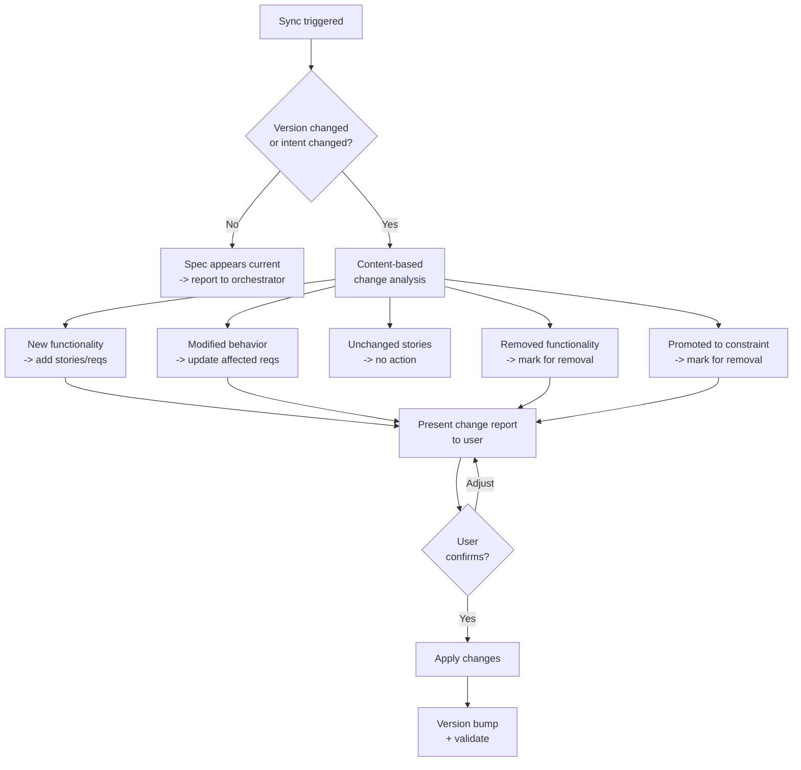

## Prerequisites

Load the `ears-requirements` skill before writing requirements. It provides the EARS sentence types and templates.

This skill is invoked by the `proven-needs` orchestrator, which provides the feature context (slug, intent, current state).

## Artifact Format

The feature specification is a single YAML file at `docs/features/<slug>/spec.yaml`. It combines user stories and their resolving EARS requirements in one artifact, validated by a JSON schema.

**Schema:** `skills/needs-features/schemas/feature-spec.schema.json`

**Validation:** `python skills/needs-features/scripts/validate-specs.py docs/features/<slug>/spec.yaml`

The YAML file has this top-level structure:

```yaml
# yaml-language-server: $schema=<path-to-schema>
schema_version: "1.0.0"
feature: <slug>
prefix: <PREFIX>
version: "1.0.0"
last_updated: "YYYY-MM-DD"

constraint_notes: []   # optional

stories:
  - id: US-001
    title: <Title>
    narrative:
      as_a: <role>
      i_want: <goal>
      so_that: <benefit>
    requirements:
      - id: <PREFIX>-001
        text: <EARS requirement text>
        ears_type: <type>
        verification: <black-box test description>
```

Each user story contains the EARS requirements that resolve it. There are no separate acceptance criteria -- the requirements ARE the specification of what the story means in testable terms.

## Observe

Assess the current state of the feature specification.

### 1. Check feature directory

Look for `docs/features/<slug>/`. If the directory does not exist, note that this is a new feature -- no spec exists yet.

### 2. Read existing spec

If `docs/features/<slug>/spec.yaml` exists:
- Read `version` and `last_updated`
- Extract all story IDs and requirement IDs
- Count total stories and requirements

### 3. Read constraints

Read `docs/constraints.yaml`. Identify any constraints relevant to this feature's domain -- these must not be duplicated as requirements but should be noted in `constraint_notes`.

### 4. Report observation

Return to the orchestrator:
```
Feature: <slug>
Spec: {exists: true/false, version: "X.Y.Z", stories: N, requirements: N}
```

## Evaluate

Given the desired state from the orchestrator, determine what action is needed.

### 1. Does the desired state require spec changes?

- If no spec exists and the intent requires one -> create spec
- If spec exists but the intent adds new functionality -> add stories/requirements
- If spec exists but the intent modifies existing behavior -> modify stories/requirements
- If spec exists and fully covers the desired state -> no action needed

### 2. Check constraints

Verify that proposed requirements would not violate any constraints:
- Requirements must be testable (quality constraint)
- Requirements must not duplicate constraint-level rules (cross-cutting requirements belong in `docs/constraints.yaml`, not in the spec)
- Each requirement must be scoped to this one feature (must not require knowledge of other features)

### 3. Report evaluation

Return to the orchestrator:
```
Action: create / add / modify / none
Stories to create: N
Stories to modify: [list]
Requirements to add: N
Requirements to modify: [list]
Constraint issues: [list or none]
```

## Execute

### Prefix assignment

Before writing the spec, determine the requirement ID prefix for this feature. The prefix is a 2-5 character uppercase code derived from the feature slug:

- `product-browsing` -> `PROD`
- `shopping-cart` -> `CART`
- `checkout` -> `CHK`
- `user-authentication` -> `AUTH`
- `password-reset-sms` -> `PRS`

Present the proposed prefix to the user for confirmation before proceeding.

### Creating a new spec

#### 1. Analyze the intent

Read the intent (desired state) provided by the orchestrator. Identify:
- The main functionality requested
- Who the users are (roles)
- What problems they want solved
- Any specific requirements mentioned

#### 2. Decompose into stories

Break functionality into atomic user stories. Each story must:
- Be implementable in 1-3 days
- Deliver clear user value
- Be scoped entirely within this feature (no cross-feature dependencies)

A story must not be phrased so broadly that it spans multiple features. If a story seems too broad, split it or flag it to the orchestrator for potential feature decomposition.

Common decomposition patterns:

| Feature Type | Typical Stories |
|---|---|
| Authentication | Login, Logout, Registration, Password Reset, Session Management |
| CRUD Operations | Create, Read, Update, Delete, List/Search |
| User Settings | View Settings, Update Settings, Preferences |
| Notifications | Subscribe, Receive, View History, Manage Preferences |

#### 3. Write requirements for each story

For each story, derive EARS requirements that fully resolve it. Each requirement must:
- Use the correct EARS sentence type (ubiquitous, event-driven, state-driven, unwanted-behavior, optional-feature, or complex)
- Be black-box testable -- the litmus test:
  > Could a tester who has never seen the source code verify this requirement using only the system's user interface or public APIs? If not, rewrite it.
- Include a verification description explaining how to test it
- Contain the word "shall"
- Be atomic (one behavior per requirement)
- Be implementation-free (states WHAT, not HOW)

**Requirements must NOT reference:**
- Internal architecture, components, or modules
- Database schemas, tables, or queries
- API endpoint paths or HTTP methods
- Programming languages, frameworks, or libraries
- Internal data structures or algorithms

**Requirements MUST describe:**
- What the user or external actor observes
- What inputs produce what outputs
- Observable system states and transitions
- Error messages and feedback presented to the user

#### 4. Check for constraint-level requirements

While writing requirements, check each one:
- Does this requirement apply only to this feature? -> Keep as a requirement
- Would this requirement apply to other features too? -> Flag to the orchestrator as a potential constraint

Example: "The system shall enforce minimum password security requirements" applies to registration, password reset, and any future password feature -> flag as a potential constraint.

If a requirement duplicates a project-wide constraint, do NOT include it. Instead, add it to `constraint_notes`:

```yaml
constraint_notes:
  - constraint: "All user input must be validated before processing."
    category: Security
    note: >-
      Input validation for search queries is enforced by the project-wide
      constraint. Not duplicated as a requirement here.
```

#### 5. Error and edge case coverage

For each happy-path requirement, consider:
- What happens with empty/missing data? -> Write an unwanted-behavior requirement
- What happens with invalid input? -> Write an unwanted-behavior requirement
- What happens at boundaries (zero items, max items)? -> Write a requirement
- What happens when an external dependency fails? -> Write an unwanted-behavior requirement

#### 6. Assign IDs

- Story IDs: Sequential within the file (US-001, US-002, ...). Zero-padded to 3 digits.
- Requirement IDs: Sequential across the entire feature (PREFIX-001, PREFIX-002, ...). Zero-padded to 3 digits. IDs are assigned in order of appearance, across all stories.

#### 7. Write the YAML file

Create `docs/features/<slug>/spec.yaml` following the schema. Include the YAML Language Server schema comment at the top for IDE validation:

```yaml
# yaml-language-server: $schema=../../../skills/needs-features/schemas/feature-spec.schema.json
```

#### 8. Validate

Run the validation script to verify the spec:

```
python skills/needs-features/scripts/validate-specs.py docs/features/<slug>/spec.yaml
```

Fix any errors before reporting completion.

### Adding stories/requirements to an existing spec

1. Read the existing spec and identify the next available story ID and requirement ID.
2. Before adding, check for stories with substantially similar scope. If a potential duplicate is found, present both to the user and ask whether to merge, replace, or keep both.
3. Assign the next sequential IDs.
4. Bump the version: MINOR (new content added).
5. Update `last_updated` to today's date.
6. Run validation.

### Modifying existing stories/requirements

1. Identify which stories or requirements the user wants to modify.
2. Present the proposed changes: show the current text alongside the new text.
3. Ask the user to confirm before applying.
4. Bump the version:
   - Requirements fundamentally rewritten or removed: MAJOR
   - Requirements refined or added (non-breaking): MINOR
   - Typos, formatting, clarifications: PATCH
5. Update `last_updated` to today's date.
6. Run validation.

### Removing stories/requirements

1. Identify the stories or requirements to remove.
2. **Warn about downstream impact:** Removing requirements may make the feature's design stale. Inform the user.
3. Ask the user to confirm.
4. Remove the items. Do not renumber remaining IDs (IDs are stable).
5. Bump the version: MAJOR (content removed).
6. Update `last_updated` to today's date.
7. Run validation. Note: the sequential numbering check will report gaps for removed IDs -- this is expected after removals and can be acknowledged.

### Syncing an existing spec

When the user modifies the intent or the orchestrator detects a need for updates:



#### 1. Content-based change analysis

1. Read the current intent and the existing spec
2. For each story and requirement, determine:
   - **New** -- no corresponding story/requirement exists -> add
   - **Modified** -- the intent changed the expected behavior -> update
   - **Unchanged** -- still aligned -> no action
3. For each existing requirement, check if its source story still makes sense
   - **Orphaned** -- story was removed -> mark for removal
4. Check for requirements that now overlap with constraints added since last sync
   - **Promoted to constraint** -- now covered by `docs/constraints.yaml` -> mark for removal

#### 2. Present change report

```
Spec sync for product-browsing:

Added:
  - US-003: Paginate Products (new story + PROD-009, PROD-010)

Modified:
  - PROD-006: Added "sorted by relevance" to search results display

Removed:
  - US-001/PROD-004: Sort feature removed per user request

No changes to: PROD-001, PROD-002, PROD-003, PROD-005, PROD-007, PROD-008
```

Ask the user to confirm before applying changes.

#### 3. Apply changes and bump versions

| Change Type | Version Bump |
|---|---|
| Stories/requirements removed | MAJOR |
| Stories/requirements added or modified | MINOR |
| Metadata-only changes | PATCH |

Update `last_updated` and run validation.

## EARS Sentence Types Quick Reference

For full reference, consult the `ears-requirements` skill. Summary of patterns:

| Type | Template | When to Use |
|---|---|---|
| Ubiquitous | The \<system\> shall \<response\>. | Always true, no trigger |
| Event-driven | When \<trigger\>, the \<system\> shall \<response\>. | Triggered by an event |
| State-driven | While \<state\>, the \<system\> shall \<response\>. | Applies in a state/mode |
| Unwanted behavior | If \<condition\>, then the \<system\> shall \<response\>. | Error/failure handling |
| Optional feature | Where \<feature\>, the \<system\> shall \<response\>. | Feature-dependent |
| Complex | While \<state\>, when \<trigger\>, the \<system\> shall \<response\>. | Multiple conditions |

## Quality Checklist (INVEST + EARS)

Before finalizing, verify:
- Every story has a clear narrative (as_a / i_want / so_that)
- Every story delivers user value
- Stories are independent and can be implemented in any order
- No story spans multiple features
- Every requirement uses the correct EARS sentence type
- Every requirement passes the black-box litmus test
- Every requirement contains "shall"
- Every requirement has a unique ID with the feature prefix
- Requirement IDs are sequential across the feature
- No duplicate IDs
- Error and edge case scenarios are covered using unwanted-behavior type
- Cross-cutting requirements have been flagged as potential constraints
- The validation script passes: `python skills/needs-features/scripts/validate-specs.py docs/features/<slug>/spec.yaml`

## Reference

See `references/product-browsing.spec.yaml`, `references/shopping-cart.spec.yaml`, and `references/checkout.spec.yaml` for complete examples showing how a feature intent becomes a YAML specification with stories and EARS requirements.
