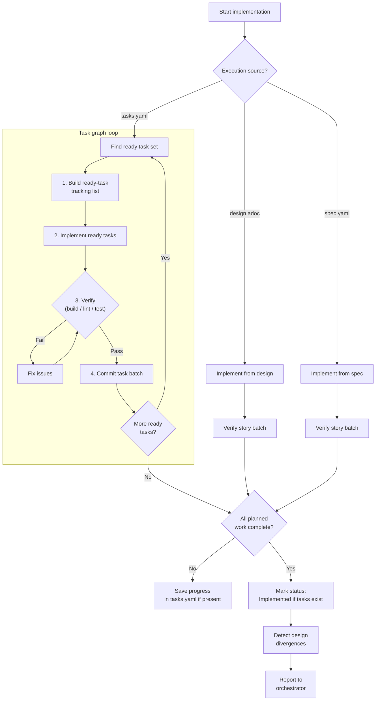

## Prerequisites

This skill is invoked by the `proven-needs` orchestrator, which provides the feature context (slug, intent, current state) and the transition plan for this feature.

## Observe

Assess the current state of implementation for this feature.

### 1. Read transition context

From the orchestrator, identify:
- The capabilities planned for this transition
- Which artifacts are expected execution inputs for implementation (`tasks.yaml`, `design.adoc`, `spec.yaml`)
- Whether execution is autonomous or interactive

### 2. Read feature task list

Read `docs/features/<slug>/tasks.yaml` if it exists. Extract `version`, `status`, any recorded provenance fields (`source_design_version`, `source_spec_version`), `overview`, and all tasks with metadata (`id`, `title`, `done`, `depends_on`, `components`, `stories`, `requirements`, `description`).

Perform a dependency analysis:
- Identify root tasks (`depends_on: []`)
- Identify ready tasks (all dependencies already done)
- Determine overall progress (`N/M done`)

**If missing:** Do not assume this is an error. The orchestrator may have selected a design-guided or spec-guided transition that skips task planning.

### 3. Read feature design

Read `docs/features/<slug>/design.adoc` if it exists. Extract system design sections, requirement resolution mappings, architectural decisions. Also read `data-model.adoc` and files in `contracts/` if they exist.

**If missing:** Note that implementation may still proceed if the transition plan intentionally skips design and provides tasks or spec as the execution source.

### 4. Read feature spec

Read `docs/features/<slug>/spec.yaml` if it exists for behavioral context:
- Story narratives for understanding user intent
- Requirement texts and EARS types for understanding expected behavior
- Verification descriptions for understanding acceptance criteria

**If missing:** Note that implementation must rely on the declared transition inputs and existing codebase context.

### 5. Read project-wide artifacts

- **`docs/constraints.yaml`** -- identify quality, architecture, and performance constraints that apply during implementation.
- **`docs/adrs/`** -- technology decisions that affect implementation choices.

### 6. Analyze codebase

Analyze current code structure, existing patterns, frameworks, and conventions to ensure new code is consistent.

### 7. Report observation

Return to the orchestrator:
```
Feature: <slug>
Transition inputs: {planned-capabilities: [...], execution-source: tasks/design/spec}
Tasks: {exists: true/false, status: "Current/Stale/Implemented", progress: "N/M done", root-tasks: N, ready-tasks: [TASK-...]}
Design: {exists: true/false, status: "Current/Stale"}
Spec: {exists: true/false, version: "X.Y.Z", stories: N, requirements: N}
Implementation: {started: true/false, completed-tasks: N, remaining-tasks: N}
Codebase: {conventions: [...], build-status: pass/fail, test-status: pass/fail}
```

## Evaluate

Given the desired state from the orchestrator, determine what action is needed.

### 1. Does the desired state require implementation?

| Condition | Action |
|---|---|
| Tasks exist, `status` is `Implemented` | Already complete. Report to orchestrator. |
| Tasks exist, `status` is `Stale` | Warn that task list is stale. Ask orchestrator whether to proceed or refresh inputs first. |
| Tasks exist, some done | Resume from the ready set in the DAG. |
| Tasks exist, none done | Start from root tasks. |
| No tasks, design exists | Design-guided implementation. |
| No tasks, no design, spec exists | Spec-guided implementation. |
| No tasks, no design, no spec | Cannot implement. Report insufficient planning context to orchestrator. |

### 2. Check constraints

- Quality constraints: tests required? coverage thresholds?
- Architecture constraints: code organization rules?
- Performance constraints: response time requirements?

### 3. Report evaluation

Return to the orchestrator:
```
Action: implement / resume / design-guided / spec-guided / none
Start point: ready task set / design story / spec story
Constraint requirements: [testing, coverage threshold, architecture rules]
```

## Execute



### Task graph execution (when `tasks.yaml` exists)

Steps 1--5 repeat for each ready task batch.

#### 1. Build ready-task tracking list

Parse the tasks whose dependencies are already satisfied from the feature's `tasks.yaml`. Create a tracking list. If a todo-list tool is available, use it. Otherwise, track by setting `done: true` on tasks in `tasks.yaml`.

- Each task title becomes a todo item, prefixed with its task ID
- All items start as `pending`
- Do **not** include tasks whose `depends_on` prerequisites are not complete

#### 2. Implement ready tasks

Work through ready tasks following the task list exactly. Do not skip dependency requirements, invent missing tasks, or reorder tasks ahead of their prerequisites.

**For each task:**

1. Mark the task as `in_progress`
2. Read the design document sections referenced in the task's `components` field when design exists
3. Read the requirement texts from `spec.yaml` for the task's `requirements` field when spec exists
4. Implement the code as described in the task's `description` and informed by the available upstream artifacts
5. Mark the task as `completed`
6. Set `done: true` on the task in `docs/features/<slug>/tasks.yaml`

**Ordering within a ready set:**
- A task is ready only when all task IDs in `depends_on` are already done
- Multiple ready tasks may be implemented in any order
- If the orchestrator is running `needs-tests`, invoke it for each task just before implementing that task

**Implementation principles:**
- Follow the design document when present for architecture, component structure, data model, and contracts
- Follow the task description for scope -- implement exactly what it describes, nothing more
- Match existing codebase conventions (naming, file structure, patterns, formatting)
- Write production-quality code -- no placeholders, no TODOs, no stubs (unless the task explicitly calls for one)
- Respect all constraints from `docs/constraints.yaml` (architecture rules, quality standards)

#### 3. Verify task batch

After all tasks in the current ready set are implemented:

1. Detect the project's verification commands by checking for `package.json`, `Makefile`, `Cargo.toml`, `pyproject.toml`, or similar
2. Run the build/compile step
3. Run the linter/type checker if available
4. If the project uses TDD (per ADR decision), run the test suite. Tests for the implemented tasks' requirements should now pass.
5. Run the full test suite to ensure no regressions in other features
6. If build, lint, or tests fail, fix before proceeding

**Constraint verification:**
- Check that quality constraints are satisfied
- Check that architecture constraints are respected

#### 4. Commit task batch

After verification passes:

1. Stage all new and modified files relevant to this task batch
2. Create a commit that describes the implemented scope, for example `feat(<feature-slug>): implement task batch`, with a body listing completed task IDs
3. If commit fails due to GPG signing, inform the user and wait for retry confirmation

#### 5. Continue through the DAG

Recompute the ready set after each verified batch.

**If more tasks remain:**
- Continue with the next ready set
- If the orchestrator is in interactive mode and the user stops here, save progress in `tasks.yaml`

**If all tasks are complete:**
1. Verify implementation against `spec.yaml` when it exists: check that all requirements have been addressed
2. If the project uses TDD, run all tests and confirm they pass
3. Set `status: Implemented` in `docs/features/<slug>/tasks.yaml`
4. Detect design divergences (see below)
5. Update `last_updated` to today's date in updated files
6. Commit task status updates
7. Report to the orchestrator that implementation is complete, along with any divergence report

#### Design divergence detection

**This step is MANDATORY after all planned implementation work completes. Do not skip it.**

If a design document exists, re-read it and compare section-by-section against the actual implementation:

1. **Re-read `docs/features/<slug>/design.adoc` in full.** Do not rely on memory of what the design said.
2. **For each section in System Design:**
   a. Identify what the design specified (components, interfaces, data flow, technology choices)
   b. Compare against what was actually implemented in code
   c. Note any differences: additions not in the design, omissions from the design, structural changes, different technology choices
3. **For each entry in Requirement Resolution:**
   a. Verify the implementation satisfies the requirements as designed
   b. Note any differences in approach or component usage
4. **If `data-model.adoc` or `contracts/` files exist:** Compare those against the actual data schema and interfaces in code.
5. **Produce a divergence report -- even if no divergences were found.**

For each divergence found:

1. **Describe the divergence:** What the design specified vs. what was actually built
2. **Analyze both resolution directions:**
   - **Update design:** Explain why updating the design to match the implementation makes sense
   - **Fix code:** Explain why adjusting the implementation to match the design makes sense
3. **Provide context:** Why the implementation diverged

Report all divergences to the orchestrator in a structured format:

```
Design divergences for <slug>:

  1. CartService validation placement
     Design: Validation logic in CartService.addItem()
     Implementation: Validation in POST /api/cart route handler
     Reason: Zod schema validation felt more natural at the API boundary
     Update design: Reflect route-level validation pattern (aligns with how other routes work)
     Fix code: Move validation into CartService (satisfies architecture constraint: business logic in service layer)

  2. ...

(or: "No divergences detected." or "No design artifact present for divergence analysis.")
```

The orchestrator presents this to the user for decision-making. This skill does NOT modify `design.adoc`.

### Design-guided implementation (when no task list exists but design does)

When implementing directly from the design without a task list:

1. **Read the Requirement Resolution section** of the feature's `design.adoc`.
2. **Implement one story at a time**, in order. For each story:
   a. Create a tracking list for the requirements
   b. Read `Components::` and `Requirements::` fields
   c. Implement all design elements mapped to the requirements
   d. If a component is shared and already partially implemented, extend rather than duplicate
3. **Verify after each story** (build, lint, typecheck, run tests if TDD is adopted).
4. **Commit after each story:** `feat(<feature-slug>): implement <Story Title>`
5. **Continue according to the orchestrator's execution mode** after each story.
6. **When all stories are implemented:**
   a. Detect design divergences using the same process described above. Report all divergences to the orchestrator. Do NOT modify `design.adoc` directly.
   b. Update timestamps in modified artifacts as needed
   c. Commit any updates
   d. Report to the orchestrator with the divergence report

### Spec-guided implementation (when only `spec.yaml` exists)

When implementing directly from the spec without tasks or design:

1. Read one story at a time from `docs/features/<slug>/spec.yaml`.
2. For each story, implement the minimum code needed to satisfy its requirements and verification descriptions.
3. Use existing codebase conventions and constraints to choose structure; do not invent architecture that contradicts project patterns.
4. Verify after each story (build, lint, typecheck, run tests if TDD is adopted).
5. Commit after each story with a scope-focused message.
6. Report any architectural ambiguity or likely design debt to the orchestrator so it can decide whether a later design artifact is needed.

## Reference

See `references/example.adoc` for a walkthrough showing how a feature's task graph becomes implemented code.
