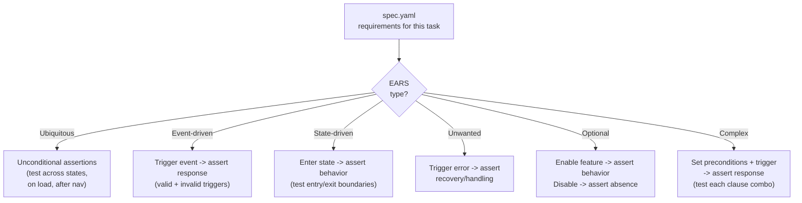

## Prerequisites

This skill is invoked by the `proven-needs` orchestrator, which provides:
- Feature context (slug, intent, current state)
- The specific task ID to create tests for
- Which requirements this task satisfies

**This capability is opt-in.** It is only available when the project has an accepted ADR recording the decision to use TDD or automated testing. The orchestrator checks for this ADR before including `needs-tests` in transition plans. If no such ADR exists, the orchestrator prompts the user to decide whether to adopt TDD for the project, and if confirmed, creates the ADR via `needs-adr` before proceeding.

## Observe

Assess the current state of tests for the specified task.

### 1. Read feature spec

Read `docs/features/<slug>/spec.yaml`. Extract all requirement IDs, EARS requirement texts, types, and verification descriptions for the requirements this task satisfies.

**If missing:** Report to the orchestrator that the spec is missing. Tests cannot be derived without specifications -- the verification descriptions in the spec are the primary source for test cases.

### 2. Read feature design

Read `docs/features/<slug>/design.adoc`. Extract system design sections, interface contracts, and data model information relevant to this task. These inform test setup, fixtures, and integration points.

**If missing:** Note that tests will be limited to black-box behavioral tests without internal structure guidance.

### 3. Read existing tests

Scan the project's test directories for existing test files:
- Match by feature slug in file/directory names
- Match by requirement ID references in test descriptions
- Check for existing test infrastructure (helpers, fixtures, factories)

Identify if any tests already exist for the requirements this task satisfies.

### 4. Read task definition

Read `docs/features/<slug>/tasks.yaml` to understand:
- Which requirements this task satisfies
- Which components are involved
- Dependencies (to understand what mocks/stubs may be needed)

### 5. Read constraints

Read `docs/constraints.yaml`. Identify quality constraints relevant to testing (coverage thresholds, test requirements).

### 6. Analyze test infrastructure

Detect the project's test framework and conventions:
- **JavaScript/TypeScript:** Jest, Vitest, Mocha, Playwright, Cypress
- **Rust:** built-in test framework, integration test conventions
- **Go:** testing package, testify
- **Python:** pytest, unittest
- **Ruby:** RSpec, Minitest

Note: test file locations, naming conventions, assertion style, existing fixtures/helpers.

### 7. Report observation

Return to the orchestrator:
```
Feature: <slug>
Task: <task-id>
Spec: {exists: true, version: "X.Y.Z", requirements-covered: [list]}
Design: {exists: true/false}
Existing tests: {count: N, for-requirements: [...], missing: [...]}
Test framework: <framework>
Coverage constraints: [list or none]
```

## Evaluate

Given the desired state from the orchestrator, determine what action is needed.

### 1. Does this task require new tests?

| Condition | Action |
|---|---|
| No tests exist for any of the task's requirements | Generate tests for all requirements this task satisfies |
| Tests exist for some requirements | Generate tests for uncovered requirements |
| Tests exist for all requirements | Tests appear current. Report to orchestrator. |

### 2. Check constraints

- Quality constraints: coverage thresholds that must be met
- Are there requirements for specific test types (unit, integration, e2e)?

### 3. Report evaluation

Return to the orchestrator:
```
Action: generate / none
Requirements to test: [list of requirement IDs]
Existing coverage: [list of already-covered IDs]
Constraint requirements: [coverage threshold, test type requirements]
```

## Execute

### Test derivation strategy



Each EARS type maps to a natural test structure:

| EARS Type | Test Pattern | What to Verify |
|---|---|---|
| Ubiquitous | Assert unconditionally | Behavior present in multiple states and contexts |
| Event-driven | Arrange -> Act -> Assert | Trigger produces expected response |
| State-driven | Enter state -> Assert | Behavior active in state, inactive outside |
| Unwanted behavior | Trigger error -> Assert recovery | System handles error gracefully |
| Optional feature | Toggle feature -> Assert presence/absence | Behavior follows feature flag |
| Complex | Set preconditions + trigger -> Assert | Response correct for the specific combination |

### Generating tests for a task

For each requirement this task satisfies:

#### 1. Read the requirement and its verification

The `verification` field in the spec describes how to test the requirement in black-box terms. Use this as the test's behavioral description.

#### 2. Determine test scope

| Design Available? | Test Scope |
|---|---|
| Yes | Use design to identify test setup (data models, API endpoints, component interfaces) |
| No | Write pure black-box tests (UI interactions or public API calls only) |

#### 3. Write the test

Follow the project's conventions for:
- File naming and location
- Test description style
- Assertion library
- Fixture/factory patterns
- Setup and teardown

**Each test must:**
- Reference the requirement ID in the test description (e.g., `it("CART-001: displays products in a grid or list format")`)
- Test exactly what the verification description says
- Be independently runnable (no dependency on other tests)
- Use the project's existing test data setup patterns

#### 4. Group tests by story

Organize test files by feature, with describe blocks mapping to stories:

```javascript
// tests/features/shopping-cart/cart-add.test.js

describe("US-001: Add to Cart", () => {
  it("CART-001: adds product to cart when add-to-cart button is clicked", () => {
    // Test implementation
  });

  it("CART-002: displays confirmation message after add", () => {
    // Test implementation
  });
});
```

### Test-first mode (TDD)

When `needs-tests` is invoked immediately before `needs-implementation` for a task:

1. Generate test files with full test implementations (setup, assertions, expectations)
2. Tests will FAIL because the production code doesn't exist yet -- this is expected and correct
3. Mark tests as pending/skipped if the test framework supports it, OR leave them failing
4. During `needs-implementation`, the implementation task is to make these tests pass

### Test-after mode

When `needs-tests` is invoked after `needs-implementation` for a task:

1. Generate test files that verify the existing implementation
2. Tests should PASS immediately if the implementation is correct
3. Any failing tests indicate implementation gaps or bugs

### Updating tests for modified requirements

When the orchestrator indicates a requirement has changed:

1. Identify which requirement IDs changed in the spec
2. Find the corresponding tests
3. Update the test descriptions and assertions to match the new requirement text
4. If a requirement was removed, remove its test (or mark as deprecated)
5. If a requirement was added, generate a new test when the task that satisfies it enters implementation

## Quality Checklist

Before finalizing, verify:
- Every requirement ID this task satisfies has at least one test
- Test descriptions reference requirement IDs for traceability
- Tests are independently runnable (no ordering dependencies)
- Tests follow the project's conventions
- Test data setup is realistic and representative
- Error cases from unwanted-behavior requirements have tests
- Tests pass (test-after mode) or fail expectedly (test-first mode)

## Reference

See `references/example.adoc` for a complete example showing how feature requirements become executable tests.