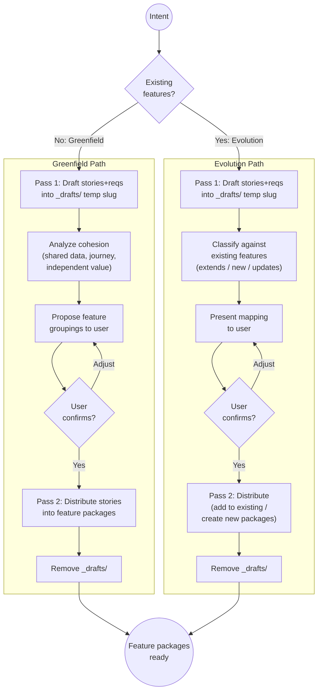
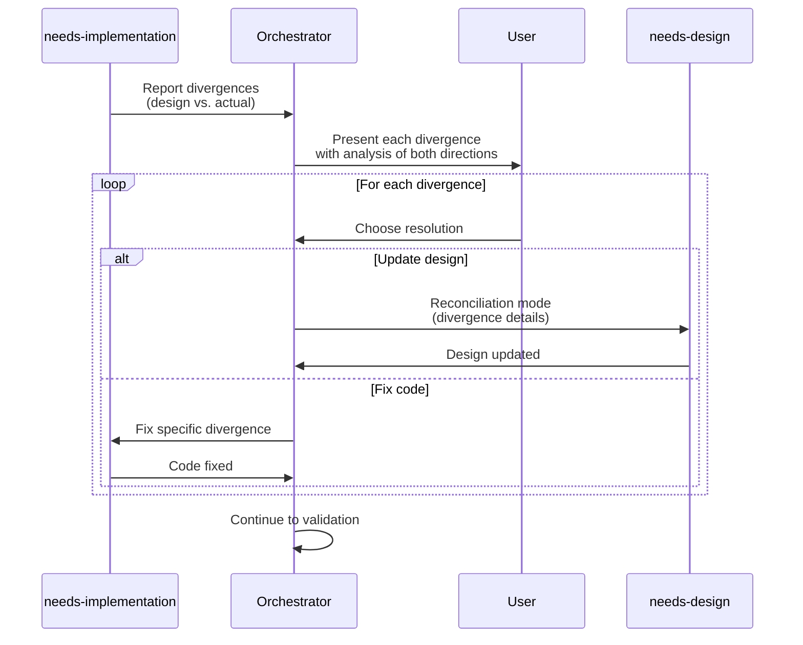
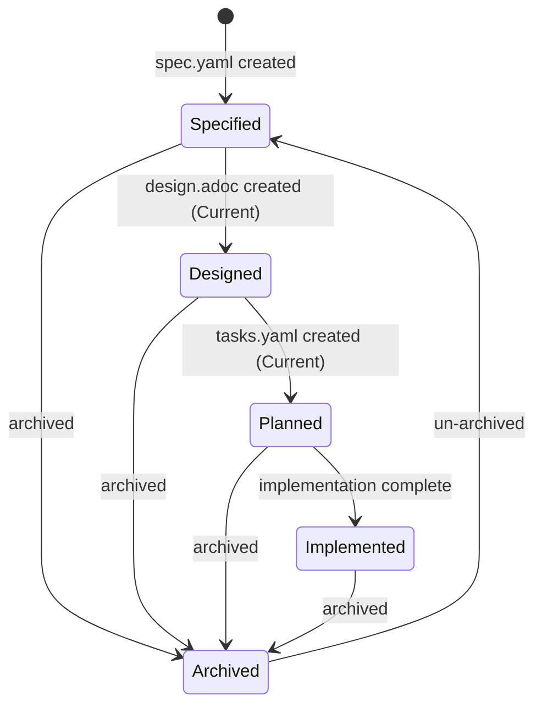

## Purpose

Continuously evolve a software system by declaring a desired state, evaluating it against the current state and constraints, then executing the minimal valid transition to make it true. Both maintenance and feature work are state changes, not task accumulation.

## State Transition Loop

```
Observe -> Declare -> Evaluate -> Derive -> Execute -> Validate -> Repeat
```

1. **Observe** -- capture the current state (automated)
2. **Declare** -- accept a desired state (from user or system-proposed)
3. **Evaluate** -- test feasibility against current state and constraints
4. **Derive** -- determine the minimal transition plan
5. **Execute** -- invoke capabilities to apply changes
6. **Validate** -- verify the desired state is now true
7. **Repeat** -- declare the next desired state

## Core Concepts

### Current State

The observable, verifiable reality of the system right now. Computed fresh each invocation, never stored.

**Artifact state:**
- Which feature packages exist in `docs/features/`
- For each feature: which artifacts exist (`spec.yaml`, design, tasks), their versions, statuses
- Project-wide artifacts: `docs/constraints.yaml`, `docs/adrs/`, `docs/architecture.adoc`, `docs/state-log.adoc`
- Staleness: has `spec.yaml` changed since design was last updated? (detected via `:source-spec-version:`)

**Codebase state:**
- Language, framework, project structure
- Dependency graph and versions (from package.json, Cargo.toml, go.mod, etc.)
- Test coverage and test status
- Lint and build status
- Security posture (known vulnerabilities in dependencies)

### Desired State

A declarative statement of what must be true after this transition. Desired states come from:
- The user (explicit intent)
- The system (detected conditions, proposed to user)

Examples:
- "Users can reset their password via SMS" (feature)
- "All dependencies have no known critical vulnerabilities" (maintenance)
- "The architecture document reflects the current system" (documentation)
- "All API endpoints enforce rate limiting" (constraint)

### Constraints (Invariants)

Rules that must not be violated across any transition. Defined in `docs/constraints.yaml`. See the Constraints section below for the full specification.

### Feature Package

A self-contained unit of work scoped to one feature. Lives in `docs/features/<slug>/`:

```
docs/features/<slug>/
  spec.yaml            # WHY + WHAT: user stories + EARS requirements (schema-validated)
  design.adoc          # HOW: implementation blueprint
  tasks.yaml           # WORK: task graph (DAG with explicit depends_on)
```

The `spec.yaml` file combines user stories and EARS requirements in one artifact. Each story contains the requirements that resolve it. The file is validated by a JSON schema (`skills/needs-features/schemas/feature-spec.schema.json`) and a consistency checking script (`skills/needs-features/scripts/validate-specs.py`).

Each feature package is fully independent -- it can be specified, designed, and implemented without reading other feature packages. Feature designs reference project-wide ADRs and architecture but never other feature designs.

### State Log

An append-only audit trail of all state transitions. Lives at `docs/state-log.adoc`. See the State Log section below for the format.

## Capabilities

The orchestrator does not produce artifacts directly. It invokes capabilities (the `needs-*` skills) to perform work. Each capability follows the observe/evaluate/execute pattern.

### Invoking a capability

To invoke a capability, **load its skill** (e.g., `needs-features`). Each capability is a separate skill with its own instructions for artifact format, quality checks, and the observe/evaluate/execute cycle.

**Do NOT attempt to perform a capability's work without first loading its skill.** The orchestrator's job is to plan and coordinate -- the capability skills contain the detailed instructions for producing correct artifacts.

Invocation steps:
1. Load the skill by name (e.g., `needs-features`, `needs-design`)
2. The capability skill will run its own observe -> evaluate -> execute cycle
3. Wait for the capability to complete and return its report before proceeding to the next capability
4. If a capability skill references another skill (e.g., `needs-design` may load `needs-adr`), that skill must also be loaded

### Feature-scoped capabilities

These operate within a single feature package:

| Capability | Skill | Domain |
|---|---|---|
| Features | `needs-features` | Create/update user stories + EARS requirements (spec.yaml) |
| Design | `needs-design` | Create implementation blueprint for a feature |
| Tasks | `needs-tasks` | Break design into task graph (DAG with depends_on) |
| Tests | `needs-tests` | Derive tests for a single task before implementation (opt-in, requires ADR) |
| Implementation | `needs-implementation` | Write and verify code for a feature |

### Project-wide capabilities

These operate at the project level:

| Capability | Skill | Domain |
|---|---|---|
| ADRs | `needs-adr` | Record technology decisions |
| Architecture | `needs-architecture` | Document current system architecture |
| Dependencies | `needs-dependencies` | Manage and update dependency graph |
| Security | `needs-security` | Assess and remediate security posture |
| Compliance | `needs-compliance` | Verify license and policy compliance |

### Supporting skills

| Skill | Purpose |
|---|---|
| `ears-requirements` | EARS methodology reference for writing requirements |

## Workflow

### 1. Observe Current State

When this skill is invoked, immediately build the current state model:

#### 1.1 Read project-wide artifacts

1. **`docs/constraints.yaml`** -- read all constraint categories and rules. If missing, note that no constraints are defined. Do not create it automatically -- the user declares constraints intentionally.

2. **`docs/features/`** -- list all feature directories. For each, check which artifacts exist (`spec.yaml`, `design.adoc`, `tasks.yaml`). Features with `:status: Archived` in `spec.yaml` are reported in the summary but skipped during intent classification and staleness checks.

3. **`docs/adrs/`** -- read the index, note how many ADRs exist and their statuses. Pay particular attention to any ADR about TDD/automated testing -- this determines whether `needs-tests` is available.

4. **`docs/architecture.adoc`** -- check existence, read `:version:` if present.

5. **`docs/state-log.adoc`** -- check existence, read recent transitions for context. Pay particular attention to:
   - **`:result: In Progress`** -- the prior session started a transition but ended unexpectedly (crash, context exhaustion, tool failure) without cleanly recording a result. The entry contains the intent and plan but `:capabilities-planned:` and `:capabilities-invoked:` may show the gap between intended and completed work. Propose resuming the transition or marking it as `:result: Failed` before starting new work.
   - **`:result: Partial`** -- the user explicitly stopped a transition mid-way. The entry lists capabilities completed vs. remaining. Propose completing the remaining capabilities before starting new work.

#### 1.2 Analyze codebase

1. **Project type** -- detect language, framework, build system from configuration files (package.json, Cargo.toml, go.mod, pyproject.toml, etc.)

2. **Dependencies** -- parse dependency files. Identify outdated packages, known vulnerabilities, archived/unmaintained packages, license information.

3. **Quality signals** -- check if build passes, linting passes, tests pass. Read test coverage if available.

4. **Code structure** -- understand directory layout, module organization, existing patterns.

#### 1.3 Present state summary

Present a concise summary to the user:

```
Current state:
  Features: 3 (user-auth [implemented], user-profile [designed], shopping-cart [specified])
  Constraints: 8 rules across 4 categories
  ADRs: 2 accepted (TDD: not adopted)
  Architecture: v1.0.0 (current)
  Codebase: TypeScript/Next.js, 47 deps (1 vulnerable), 78% coverage, build passing
  Staleness: user-profile spec.yaml changed since last design update
```

### 2. Accept Desired State

The user states what they want to be true. The orchestrator interprets this as a desired state.

#### 2.1 Intent classification

Classify the desired state into one or more intent types:

| Intent Type | Signals | Example |
|---|---|---|
| **Feature evolution** | Describes user-facing capability, has a user journey | "Users can reset password via SMS" |
| **Constraint declaration** | Universal quantifiers, system-as-subject, applies to features that don't exist yet | "All API endpoints must enforce rate limiting" |
| **Artifact maintenance** | References existing artifacts, sync/update language | "Spec is in sync with current intent" |
| **Dependency maintenance** | References packages, versions, vulnerabilities | "No dependencies have known vulnerabilities" |
| **Architecture evolution** | References system structure, technology changes | "Authentication uses OAuth2 instead of sessions" |
| **Quality improvement** | References tests, coverage, code quality | "All API endpoints have integration tests" |
| **Documentation** | References docs, architecture document | "Architecture doc reflects current system" |

#### 2.2 Constraint detection

Before proceeding with feature decomposition, check whether the intent is actually a constraint. An intent is a constraint if:

1. **Universal scope** -- it uses quantifiers like "all", "every", "no X may", "must always", "never"
2. **System-as-subject** -- it describes a property of the system, not a capability for a user
3. **No user journey** -- there is no identifiable user role, action, or benefit
4. **Future-proof** -- it would apply to features that don't exist yet

If the intent is a constraint:
- Propose adding it to `docs/constraints.yaml` with the appropriate category
- Ask the user to confirm
- If confirmed, update `docs/constraints.yaml` and record the transition in the state log
- Do not create a feature package

If uncertain, ask the user:
```
Your intent could be interpreted as:
  1. A project-wide constraint (enforced on all features, current and future)
  2. A feature-specific requirement (applies only to one feature)

Which did you mean?
```

#### 2.3 TDD decision check

When the orchestrator encounters a feature evolution intent for the first time (or when the user explicitly asks about testing), check whether a TDD/automated testing ADR exists:

- **If no TDD ADR exists:** Ask the user:
  ```
  This project doesn't have an automated testing strategy yet.
  Would you like to adopt TDD for this project?

    1. Yes -- tests will be derived from requirements before implementation (creates ADR)
    2. No -- manual verification against spec.yaml requirements only
  ```
  If the user chooses yes, invoke `needs-adr` to create the TDD ADR. This enables `needs-tests` in the pipeline.

- **If a TDD ADR exists and is accepted:** Include `needs-tests` in transition plans.

- **If a TDD ADR exists but is superseded/deprecated:** Do not include `needs-tests`.

#### 2.4 Feature decomposition (for feature evolution intents)



**When no features exist yet (greenfield):**

This uses a two-pass approach because `needs-features` operates within a feature package (requires a slug), but feature groupings aren't known until stories are drafted.

**Pass 1 -- Draft stories with a temporary slug:**

1. Invoke `needs-features` with a temporary working slug (e.g., `_drafts`) to derive user stories and requirements from the intent. This produces an initial spec.yaml without committing to a feature structure.
2. Analyze story cohesion to propose feature groupings:
   - Stories that share the same data entities -> same feature
   - Stories in the same user journey -> same feature
   - Stories that can deliver independent value -> separate features
3. Present the proposed grouping to the user:
   ```
   Based on your intent, I propose 3 features:

   Feature 1: product-browsing (prefix: PROD)
     - US-001: View Product Catalog (PROD-001 through PROD-004)
     - US-002: Search Products (PROD-005 through PROD-008)
     (Share product data and catalog UI)

   Feature 2: shopping-cart (prefix: CART)
     - US-001: Add to Cart (CART-001 through CART-003)
     - US-002: View Cart (CART-004 through CART-007)
     (Share cart state and cart data)

   Feature 3: checkout (prefix: CHK)
     - US-001: Checkout Process (CHK-001 through CHK-005)
     (Independent user journey with payment flow)

   Adjust grouping?
   ```
4. Wait for user confirmation before creating feature packages.

**Pass 2 -- Distribute stories into feature packages:**

5. For each confirmed feature, invoke `needs-features` with the final slug to create the feature's `spec.yaml`, distributing the drafted stories into their assigned feature packages. IDs are reassigned to be sequential within each feature.
6. Remove the temporary `_drafts` directory if it was created on disk.

**When features already exist (evolution):**

Same two-pass approach. Stories are drafted first, then classified against existing features.

**Constraint surfacing during decomposition:**

While deriving stories and requirements, if a requirement is identified as cross-cutting:
1. Flag it as a potential constraint
2. Present to the user:
   ```
   While deriving requirements for user-authentication, I found a cross-cutting requirement:
     "Passwords must be at least 8 characters with mixed case and numbers"

   This applies to registration, password reset, and any future password feature.

   Options:
     1. Add to docs/constraints.yaml (recommended -- enforced everywhere)
     2. Keep as feature requirement (only enforced in this feature)
   ```

### 3. Evaluate Feasibility

For each feature in the transition plan, check:

#### 3.1 Precondition check

Does the desired state require artifacts that don't exist yet? For each involved capability:
- `needs-design` requires spec.yaml -> does it exist?
- `needs-tasks` works best with design -> is design available?
- `needs-implementation` requires at least one declared execution input (`tasks.yaml`, `design.adoc`, or `spec.yaml`) -> which artifact will drive implementation?
- `needs-tests` requires spec.yaml -> does it exist? Is TDD adopted (ADR)?

If preconditions are unmet, the orchestrator can satisfy them as part of the transition (by invoking earlier capabilities first). This is not a pipeline -- the orchestrator dynamically determines what's needed.

#### 3.2 Constraint check

Test the proposed transition against all constraints in `docs/constraints.yaml`:
- Would any constraint be violated by the proposed changes?
- Are there existing constraint violations that should be resolved first?

If a constraint would be violated:
```
Constraint violation detected:

  Architecture constraint: "Business logic resides in the service layer"
  Proposed design places validation logic in route handlers.

Options:
  1. Revise the design to satisfy the constraint
  2. Update the constraint (requires justification)
  3. Abort this transition
```

#### 3.3 Staleness check

Check if any existing artifacts involved in the transition are stale:
- spec.yaml updated but design not refreshed? (`:source-spec-version:` mismatch)
- tasks.yaml invalid because it records no upstream provenance? (neither `source_design_version` nor `source_spec_version` exists)
- Design updated but tasks not refreshed? (check only when `source_design_version` exists in tasks.yaml)
- spec.yaml updated but tasks not refreshed? (check only when `source_spec_version` exists in tasks.yaml)
- Feature implemented but architecture not updated?

Report staleness and recommend resolution before proceeding.

### 4. Derive Transition Plan

Build a dependency graph of capability invocations. The graph is derived, not hardcoded.

**For each feature in scope:**

1. Determine which artifacts need creating or updating
2. Decide which capabilities are required for this intent before execution begins, then order them by dependency. Common paths include features -> design -> tasks -> implementation, features -> design -> implementation, or features -> implementation when the intent intentionally skips intermediate artifacts. `needs-features` is included whenever the transition needs a feature spec, but it is not forced for every transition.
3. If TDD is adopted (ADR exists), `needs-tests` is invoked per-task, just before that task enters implementation. Tests are created on-demand as the task graph is traversed, not in bulk upfront.
4. Skip capabilities whose artifacts are already current and satisfy the desired state
5. Mark which steps can run in parallel across features (independent features can be processed concurrently)

**Architecture updates:**

After all feature implementations in the current transition are complete, invoke `needs-architecture` if:
- Any feature implementation changed the system's component structure
- The architecture document doesn't exist yet
- The architecture document is stale relative to the implemented features

Do not invoke `needs-architecture` mid-transition between features.

**Present the plan to the user:**

```
Transition plan to achieve "Users can reset password via SMS":

  Feature: user-authentication/ (extend existing)
  1. needs-features: Add SMS password reset stories + requirements to spec.yaml
  2. needs-design: Update design for SMS flow
  3. needs-tasks: Create task graph (DAG with depends_on)
   4. needs-implementation: Implement code changes
      - For each task: invoke needs-tests (if TDD) just before implementation
   5. needs-architecture: Update after implementation (post-transition)

   capabilities-planned: needs-features, needs-design, needs-tasks, needs-implementation, needs-architecture

  Skipping: needs-adr (no new technology decisions)
  Skipping: needs-tests (TDD not adopted)
  Post-transition: needs-architecture (update after all features implemented)

  Risk: HIGH (new feature behavior, code changes)
  Estimated artifacts affected: spec.yaml, design.adoc, tasks.yaml, code

  Proceed?
```

#### Execution mode

After the user approves the transition plan, ask how they want the workflow to execute:

```
How should I proceed through the capabilities?

  1. Autonomous -- execute all capabilities without pausing between them
  2. Interactive -- ask for confirmation before starting each capability
```

Store the user's choice for the duration of this transition. Default to **Interactive** if the user does not express a preference.

### 5. Execute Transition

**Before invoking the first capability**, append an `In Progress` entry to `docs/state-log.adoc` with the fields known so far: `:date:`, `:intent:`, `:type:`, `:risk:`, `:features:`, `:desired-state:`, `:prior-state:`, `:capabilities-planned:`, and `:result: In Progress`. Leave `:capabilities-invoked:`, `:constraints-checked:`, and `:artifacts-modified:` empty -- these are filled in when the transition completes or is stopped.

Invoke capabilities in the derived order by loading each capability skill. For each capability:

1. The orchestrator passes the feature context (slug, desired state, current state for that feature)
2. The capability runs its observe -> evaluate -> execute cycle
3. The orchestrator validates the capability's output before proceeding to the next

**Between capabilities:**
- Verify the artifact was created/updated correctly
- Check that no constraints were violated
- Update the state model

**Task graph execution (when `needs-tasks` created a DAG):**

When `needs-tasks` produces a task graph with `depends_on` edges:

1. Perform topological sort to determine safe execution order
2. Identify root tasks (no dependencies) -- these can start immediately
3. When TDD is adopted, for each task ready to execute:
   - If the task's requirements have no tests yet, invoke `needs-tests` for this specific task
   - Then invoke `needs-implementation` for this task
4. A task is ready when all its `depends_on` tasks are complete
5. Ready tasks with no dependencies can run in parallel

```
Task execution order (example):
  TASK-001 (root)  --> TASK-002 --> TASK-006
                     --> TASK-003 --> TASK-007
                     --> TASK-004 --> TASK-008
                     --> TASK-005 --> TASK-009
  
  Execution: TASK-001 first (root), then TASK-002 through TASK-005 in parallel,
  then TASK-006 through TASK-009 in parallel (after their dependencies complete)
```

### Transition progress tracking

Maintain an explicit checklist of all capabilities to invoke for this transition. Use the todo-list tool if available. After each capability completes, mark it done.

**Execution mode behavior:**
- **Interactive mode:** After each capability completes, present the updated checklist and ask the user whether to continue to the next capability.
- **Autonomous mode:** After each capability completes, immediately proceed to the next capability without asking. Report progress inline.

In both modes, the following rules apply:
- **Do NOT skip capabilities in the plan.** Every capability in the derived transition plan must be invoked unless the user explicitly asks to stop.
- **Do NOT treat `needs-implementation` as the final step.** Post-implementation capabilities (`needs-architecture`, design divergence resolution) are part of the plan and must execute.
- If the user asks to stop mid-transition, update the existing `In Progress` entry in `docs/state-log.adoc`: set `:result: Partial`, fill in `:capabilities-invoked:` with capabilities completed so far, and add `:capabilities-remaining:` listing what was planned but not yet invoked.

**Design divergence resolution (after `needs-implementation` completes):**



When `needs-implementation` finishes, it reports any divergences between the design and what was actually built. Present this analysis to the user with enough context to make a good decision.

**Divergence report verification (MANDATORY):**
After `needs-implementation` completes, verify that it produced a divergence report. If no report was provided, request the report before proceeding. Do not proceed to validation without a divergence report -- it is a required output of the implementation phase.

**Error handling:**
- If a capability fails validation -> stop, report to user, ask how to proceed
- If a constraint is violated during execution -> stop, report, offer to revise or abort
- If the user wants to stop mid-transition -> save progress, update the `In Progress` entry to `:result: Partial` in state log

### 6. Validate

After all capabilities in the transition have executed:

1. Re-observe the current state
2. Compare against the original desired state
3. Verify all constraints still hold
4. Run verification commands (build, test, lint) if code was changed
5. Run `python skills/needs-features/scripts/validate-specs.py` on any modified spec.yaml files

**If desired state achieved:**
- Present validation summary to user and request approval:
  ```
  Validation complete. The desired state appears to be achieved:
    - All capabilities executed successfully
    - Constraints verified (all pass)
    - Build passing
    - Tests passing (if TDD adopted)
    
  Approving this transition will record :result: Achieved in the state log.
  
  Do you approve this transition as achieved?
    1. Yes -- record Achieved
    2. No -- investigate issues
  ```
- **If user approves:** Update the existing `In Progress` entry in `docs/state-log.adoc`: set `:result: Achieved`, fill in `:capabilities-invoked:`, `:constraints-checked:`, and `:artifacts-modified:`, report success to user
- **If user rejects:** Identify what's missing, propose additional steps or report what went wrong, do not update the entry to `:result: Achieved`

**If desired state NOT achieved:**
- Identify what's missing
- Propose additional steps or report what went wrong
- Do not update the entry to `:result: Achieved`

### 7. Record Transition

Update the existing `In Progress` entry in `docs/state-log.adoc` with the final result.

## Risk Classification and Auto-Approve

Transitions are classified by risk level:

| Risk Level | Auto-approve? | Criteria |
|---|---|---|
| **Low** | Yes, execute immediately | Patch dependency updates; sync design with unchanged requirement semantics; format/metadata fixes; documentation updates |
| **Medium** | Propose with summary, ask | Minor dependency updates; design adjustments for modified requirements; syncing design with updated spec |
| **High** | Full plan, require approval | New features; breaking changes; architecture changes; major version bumps; constraint modifications; code changes |

## Constraints Specification

### File location and format

`docs/constraints.yaml`, validated by `skills/proven-needs/schemas/constraints.schema.json`:

```yaml
# yaml-language-server: $schema=../../skills/proven-needs/schemas/constraints.schema.json

schema_version: "1.0.0"
version: "1.0.0"
last_updated: "YYYY-MM-DD"

categories:
  - name: Security
    constraints:
      - id: C-001
        text: Passwords must be at least 8 characters with mixed case and numbers.
      - id: C-002
        text: All user sessions must expire after 24 hours of inactivity.
      - id: C-003
        text: >-
          No dependency with a known CRITICAL or HIGH CVE may remain
          unpatched for more than 7 days.
      - id: C-004
        text: All user input must be validated before processing.

  - name: Licensing
    constraints:
      - id: C-005
        text: Only MIT, Apache-2.0, and BSD-licensed dependencies are permitted.

  - name: Architecture
    constraints:
      - id: C-006
        text: Business logic resides in the service layer, not in route handlers.
      - id: C-007
        text: No direct database access from UI components.

  - name: Quality
    constraints:
      - id: C-008
        text: Test coverage must not decrease per feature implementation.
      - id: C-009
        text: All code passes linting and type checking.

  - name: Performance
    constraints:
      - id: C-010
        text: API P95 response time must remain below 200ms.
```

**Validation:** `python skills/proven-needs/scripts/validate-constraints.py docs/constraints.yaml`

Each constraint has a unique ID (C-001, C-002, ...) for traceability. Constraint IDs are sequential across the entire file, not within categories.

### Constraint lifecycle

- **Adding:** User declares intent that is classified as constraint, or constraint is surfaced during requirement derivation. Always requires user confirmation. MINOR version bump.
- **Modifying:** User explicitly requests relaxing or tightening a rule. Requires user confirmation. MINOR or MAJOR bump depending on impact.
- **Removing:** User explicitly requests removal. Requires confirmation with warning about enforcement loss. MAJOR version bump.

### Constraint enforcement

Every capability checks relevant constraints during its Evaluate phase:
- `needs-features`: checks quality constraints (testability, completeness) and that requirements do not duplicate project-wide constraints
- `needs-design`: checks architecture constraints
- `needs-tasks`: checks quality constraints (testing tasks exist if coverage constraints apply)
- `needs-tests`: checks quality constraints (coverage thresholds, test requirements)
- `needs-implementation`: checks quality, performance, architecture constraints
- `needs-dependencies`: checks licensing, security constraints
- `needs-security`: checks security constraints
- `needs-compliance`: checks licensing constraints

A constraint violation blocks a transition unless the user explicitly chooses to update the constraint.

## State Log Specification

### File location and format

`docs/state-log.adoc`:

```asciidoc
= State Transition Log
:last-updated: YYYY-MM-DD

== TRANSITION-003
:date: 2026-02-23
:intent: Users can reset their password via SMS
:type: Feature evolution
:risk: High
:features: user-authentication (extended)
:desired-state: SMS password reset is available alongside email reset
:prior-state: user-authentication has email reset only (implemented)
:capabilities-planned: needs-features, needs-design, needs-tasks, needs-implementation
:capabilities-invoked: needs-features, needs-design, needs-tasks, needs-implementation
:constraints-checked: Security (pass), Architecture (pass), Quality (pass)
:result: Achieved
:artifacts-modified: docs/features/user-authentication/spec.yaml (v1.1.0), docs/features/user-authentication/design.adoc (v2.0.0), docs/features/user-authentication/tasks.yaml (v1.0.0), source code

== TRANSITION-002
...
```

### State log conventions

- Transitions are numbered sequentially (TRANSITION-001, TRANSITION-002, ...)
- Newest transitions appear first (reverse chronological)
- Entries are created at the start of execution with `:result: In Progress` and `:capabilities-planned:`, then updated with `:capabilities-invoked:` and the final result
- `:result:` values: `In Progress`, `Achieved`, `Partial`, `Failed`

## Feature Package Conventions

### Slug naming

Feature directory names use kebab-case derived from the feature's primary purpose:
- `user-authentication`
- `password-reset-sms`
- `shopping-cart`

Slugs are stable -- do not rename feature directories after creation.

### Feature status

A feature's status is derived from which artifacts exist and their states:



| Artifacts Present | Derived Status |
|---|---|
| spec.yaml only | `Specified` |
| + design.adoc (status: Current) | `Designed` |
| + tasks.yaml (status: Current) | `Planned` |
| Implementation complete, all requirements verified | `Implemented` |
| `:status: Archived` in spec.yaml | `Archived` |

### Artifact versioning within features

`spec.yaml` uses SemVer independently. Downstream artifacts track their upstream:
- `design.adoc` tracks `:source-spec-version:`
- `tasks.yaml` tracks whichever upstream provenance fields apply to the transition (`source_design_version`, `source_spec_version`, or both). At least one must be present.

### Format and dates

Feature specifications use YAML (`.yaml`). Design artifacts use AsciiDoc (`.adoc`). Task artifacts use YAML (`.yaml`). Dates use `YYYY-MM-DD` format. Diagrams use Mermaid.

### Requirement syntax

All behavioral specifications use EARS (Easy Approach to Requirements Syntax). The `ears-requirements` skill provides the methodology reference.

### Black-box constraint

Feature requirements (`spec.yaml`) describe only externally observable behavior. Internal architecture details belong in the feature design document, project-wide architecture, and ADRs.

## Bootstrap

When this skill is loaded, **immediately** check the project's `AGENTS.md` for the proven-needs workflow marker.

### Steps

1. Read `AGENTS.md` in the project root (it may not exist yet).
2. Search for the marker `<!-- proven-needs:start -->`.
3. **If the marker is found** -- do nothing, the project is already bootstrapped.
4. **If the marker is NOT found** -- insert the new block at the very top of the file (or create the file with the block if it does not exist).

```markdown
<!-- proven-needs:start -->
## Development Workflow (Required)
All changes to this project **must** follow the proven-needs state transition workflow.
Before making any changes, **load the `proven-needs` skill**. Do not modify code, documentation,
or project artifacts without first going through the workflow it defines.
<!-- proven-needs:end -->
```

5. Inform the user that `AGENTS.md` was updated.

### Rules

- This check runs **every time** the skill is loaded, but is idempotent.
- Insert at the **top** of the file so the workflow requirement is the first thing agents see.
- Do NOT modify content between the markers if the block already exists.
- Perform this check **before** proceeding with any other workflow task.
